
# Cloud compare - basics

Hopefully you have installed CloudCompare already on your laptops. If not, please download and install the latest stable release from: [https://www.danielgm.net/cc/](https://www.danielgm.net/cc/) . In this tutorial version 2.12.3 Kyiv was used.

## Loading and visualizing data 

Go to **File> Open** and navigate to the point cloud file, changing the drop-down file type to ‘LAS cloud (.las, .laz)

Open the **"pine_stand.las"** file and leave the import settings as defaults – this will import the x,y,z locations of the points in the point cloud and in case there are any additional information stored in the point cloud (such as laserscanning intensity, amplitude, scan angle, etc.) these would be opened as well as so called "scalar fields".

The "Scalar fields" of a  point cloud are similar to what we would call an "attribute table" in a vector file. 

You should now see a scan loaded in the main CC viewer. Highlight the scan name in the DB tree window as shown in Figure 1.

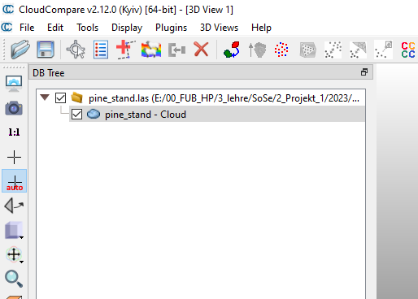

**Figure 1: DB tree window after loading the dataset**

We will now adjust the coloring of the point cloud and assign the color of each point by its height (z-value).

For this we select "Edit" -> "Colors" -> "Height Ramp" (Figure 2) and in the new pop-up window (Figure 3) we keep the standard settings, make sure that the in the "direction" field "z" is selected and click "OK".

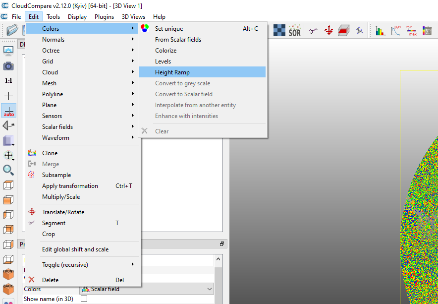

**Figure 2: Editing the color scale 1/2**

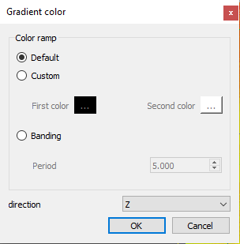

**Figure 3: Editing the color scale 2/2**

This will result in a new visualization as seen in Figure 4. We can now quite clearly identify crowns of individual trees in the point cloud which have reddish values while blueish and greenish colors indicate lower point cloud heights.

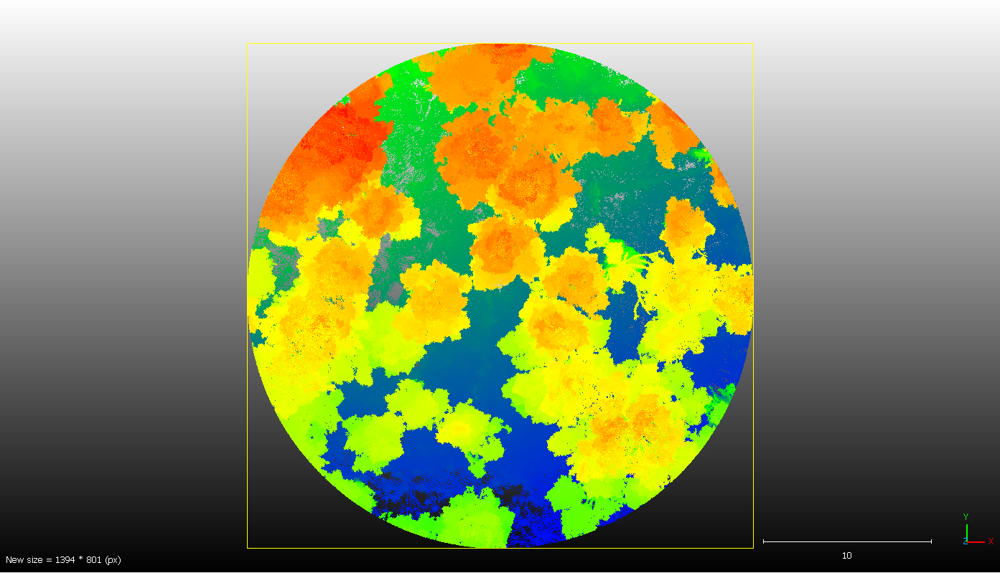
**Figure 4: Visualization of the point cloud after editing the colors**

In the "**Properties**" window we can see basic information about the point cloud we loaded. Amongst others we can see the "**box dimensions**" which describes the bounding box which contains all points of the point cloud - in our case this box is roughtly 30 by 30 by 30 m.
We can also see the total **number of points** in the point cloud which is "12,174,566"
Further below in the "**SF display params**" we can see and in theory also modify the color-ramp settings. SF stands for "Scalar Field". At the moment the color of each point in the point cloud is assigned based on its height value and we can see that the colors range from dark blue up to red. Changing the SF display parameters will not affect the main display in our case since the points are currently colored based on their height value and not based on a scalar-field value (our point cloud does not have any additional information attached).

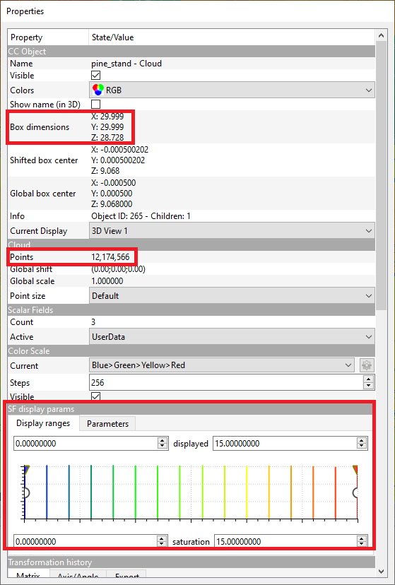

**Figure 5: The properties window**

In case you want to change the background color shown in the main visualization window you can do so by selecting "Display" -> "Display settings". In the new appearing window select "Colors and Materials" and then under the section "Colors" change the "Background" color.

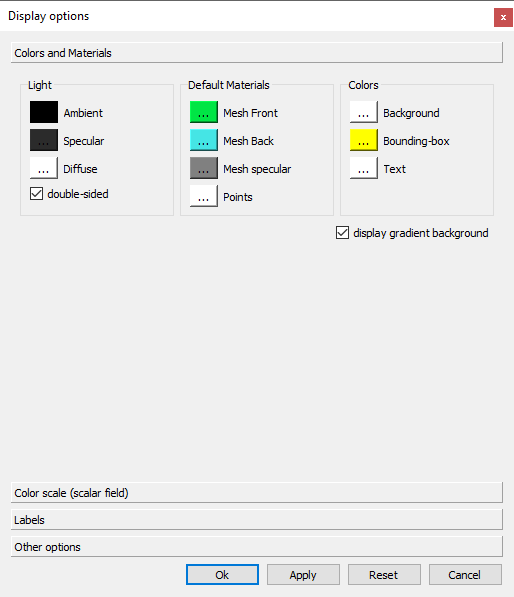

**Figure 6: Changing the background color**

You can of course also play around with the other settings and see how this affects the visualization in the main visualization window.

## Navigating in / rotating the point cloud

The visualization window of CloudCompare is interactive and you can rotate and zoom in and out of the point cloud. The basic navigation commands are the following:

- to **rotate** the point cloud **click and hold the left mouse button** and move the mouse
- to **move the whole point cloud** in the visualization window **click and hold the right mouse button** and move the mouse to move the point cloud
- to **zoom-in and out** of the point cloud use the **mouse-wheel** and scroll up and down

In case you "get lost" in the point cloud you can use some of the **buttons** provided on the left in the graphical user interface and marked in Figure 5. By clicking these buttons CloudCompare will always **zoom to the whole point** cloud and set the view point either to the side, to the top or the bottom of the point cloud as indicated by the icons of the buttons.

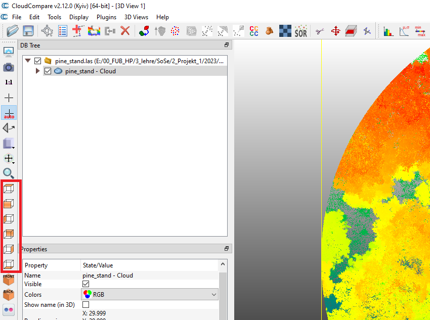

**Figure 7: Navigations button in Cloud compare.**

Finally, another option to rotate and navigate in the point cloud appears also once you click the and hold the left mouse button. In Figure 7 you can see that **a red, a blue and a green circle** appear. You can use these circles to r**otate the point cloud** within the corresponding axes. It takes a bit of time to get used to this but then navigation should work smoothly.

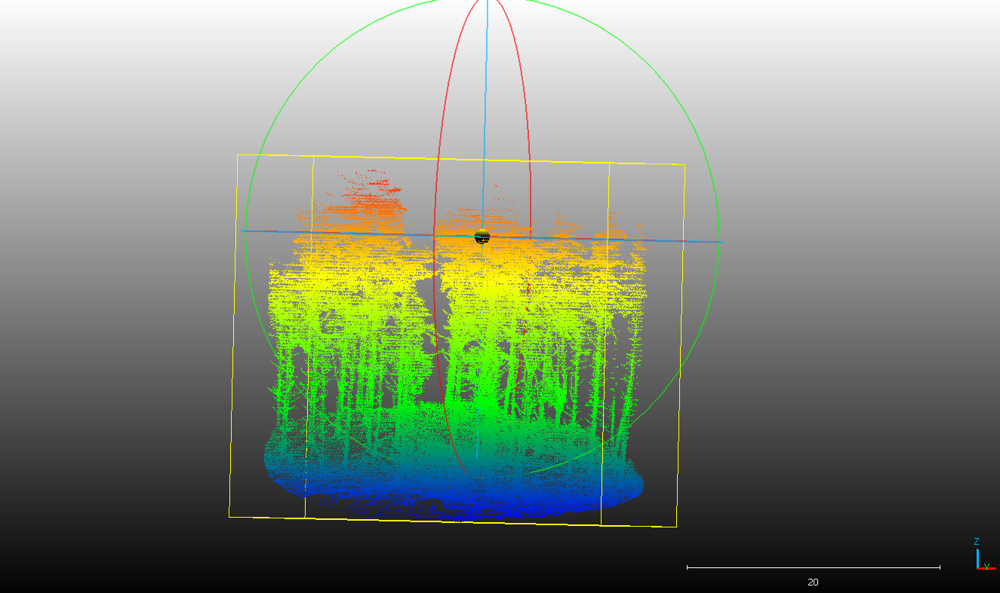

**Figure 8: Navigations rings in Cloud Compare.**

## Export current view

If you want to export the current view of the main visualization window you can always do so by selecting "Display" -> "Render to File". In the upcoming window you can define an output filename and by defining the "zoom" value you can increase the resolution of the resulting image.

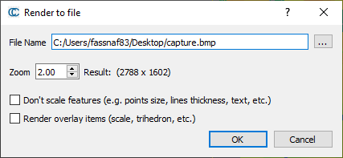

**Figure 9: Render to File.**

## Subsetting data 

In some cases we might be not interested in analysing the complete point cloud that we have available but only a subset - for example a group of trees or a small number of building. We can manually create a subset of a point cloud using CloudCompare and a few simple steps.

To not lose our original point clohd, we will first copy the original scan in the viewer by highlighting the scan name, then selecting "Edit" -> "Clone"
 
This produces a fresh copy we can segment without losing data from the original point cloud (note you can always also re-import the original scan as long as you don’t over-write when saving / exporting your segmented version). Now untick the original scan and highlight the cloned scan name (Figure 10).

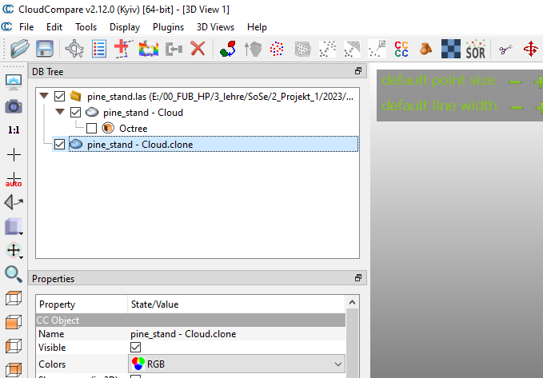

**Figure 10: Cloned file highlighted.**

Next we click on the scissors tool (Marked with 1 in Figure 11) and then draw a polygon over a small area of the point cloud that is of interest (it doesn’t matter where too much at this stage, but keep it fairly small and include some trees). In my case I will try to define a subset area which contains two trees. I start with an overhead-view. While using the scissors tool, left click of the mouse is used to specify vertices and right click to complete the polygon when done. You should see a  box / shape displayed (Marked with 2 in Figure 11). You will also realize that once you click the scissors tool it will grey-out along with the other buttons but a new window with new buttons (the segment tool) appears (Marked with 3 in Figure 11).

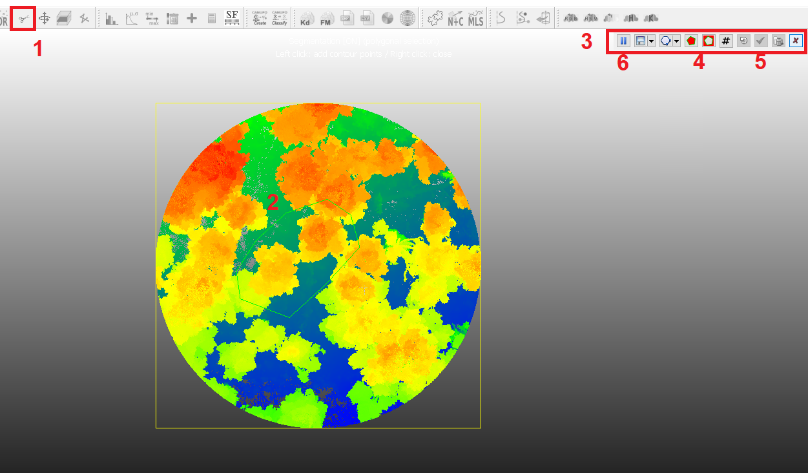

**Figure 11: The scissors tool to subset a point cloud.**

The segment tool provides two options to cut out the areas you have specified. You can either click the button where the areas inside the polygon are red (keep all points within the polygon) or the button where the areas outside the polygon are red (keep all points except for the points in the polygon) (Marked with 4 in Figure 11). In our case we will select the button to keep only the points in the polygon. And then we click they green arrow button (marked with 5 in Figure 11).

A new point cloud will now appear in the list in the ‘DB Tree’ window which contains just the segment you extracted. Untick the ‘remaining’ point cloud and you will see just the segmented section displayed, allowing you to view it more easily. You might also have to untick the original point cloud in case it is still activated.

Note, the original cloud is also retained unchanged, so if you want to try again, highlight the segmented cloud, right click and choose ‘delete’ then repeat the above steps (from cloning!). 

Selecting a side-view mode from the navigations buttons (Figure 7) in my specific case results in the view shown in Figure 12. Your view is likely to differ depending on how you selected your subset-area.

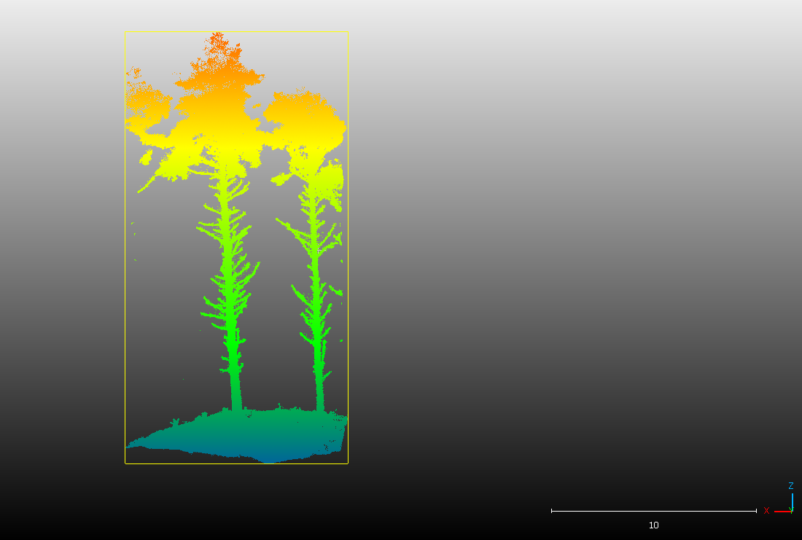

**Figure 12: Point cloud after subsetting.**

We can see in Figure 12, that the in my case I did not only segment the two trees I targeted but also have some points in the subset which are likely to not belong to the two trees. I could now try to use the scissors tool again to get rid of these points. The scissors tool can not only be used from a top-view but also from all other view perspectives. You can even switch from one perspective to another while defining polygons by clicking the  "pause" button (marked with 6 in Figure 11). This will then allow you rotate the point cloud to a different view of the roughly segmented tree. You can then unpause the segmentation and draw a further polygon and click one of the two buttons to remove additional points (most likely you will select the button for remaining all points outside the polygon now). You can repeat this process as often as you want. Once you are happy with your final tree segment, click the green confirmation symbol as done before and a new entry will appear in the TreeDB window.

## Exporting data

Exporting point clouds in CloudCompare is straightforward and can be accomplished by first selecting the point cloud file you want to export in the TreeDB window and then selecting "File" -> "Save". You can then chose between a large range of typical point cloud formats (Figure 13).

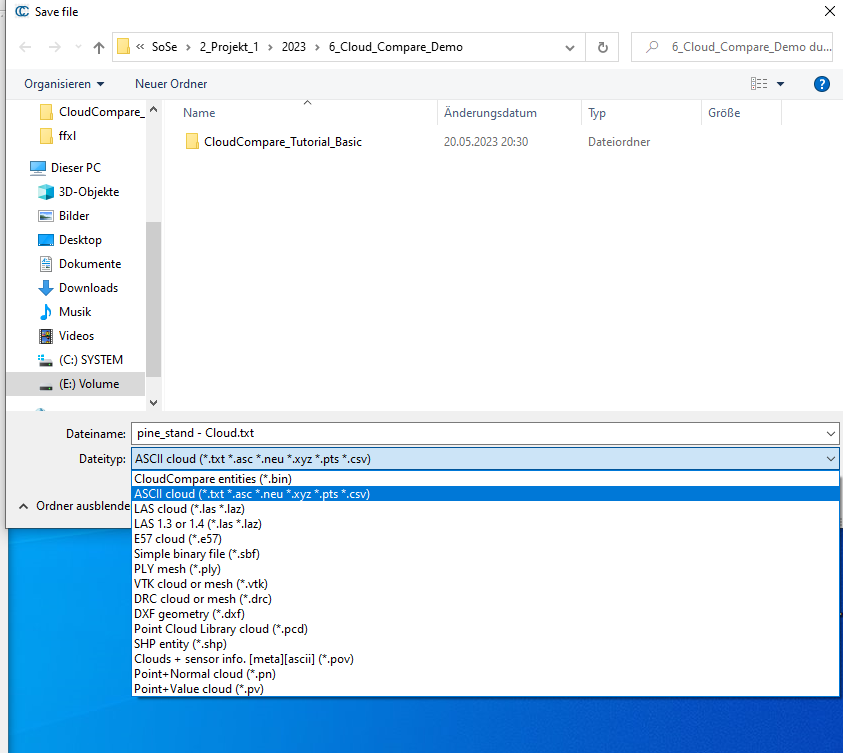

**Figure 13: Exporting point clouds.**
